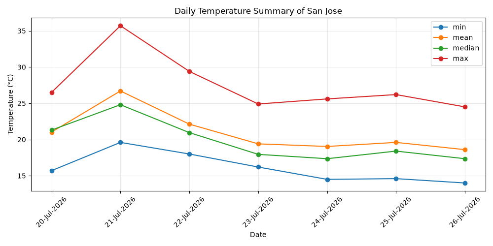

# Weekly Weather Analyzer

This model fetches the past 7 days of hourly temperature data for any city and generates a daily summary table and chart. It is powered by the free Open-Meteo API.

## What it does

1. Asks for a city name and finds its coordinates using the Open-Meteo Geocoding API
2. Fetches the past 7 days of hourly temperature data for that location
3. Saves the raw hourly data to `Temperature.csv`
4. Calculates the daily minimum, average, median, and maximum temperature
5. Saves the daily summary to `Daily_Summary.csv`
6. Plots the four daily statistics as a line chart

## How to run

1. Install the required libraries: pip install -r requirements.txt
2. 2. Run the script: python "Complete Code.py"

## Output files

| File | Description |
|------|-------------|
| `Temperature.csv` | Raw hourly temperature data (168 rows) |
| `Daily_Summary.csv` | Daily min/mean/median/max, one row per day |
| `weekly_temperature.png` | Line chart of the daily summary |

## Sample output

**Daily summary table:**

**Weekly temperature chart:**

## Built with

- [Python](https://www.python.org/)
- [requests](https://pypi.org/project/requests/) — fetching data from the web
- [pandas](https://pandas.pydata.org/) — organizing and summarizing data
- [matplotlib](https://matplotlib.org/) — charting

## Data source

Weather and geocoding data provided by [Open-Meteo](https://open-meteo.com/), a free, open-source weather API.
